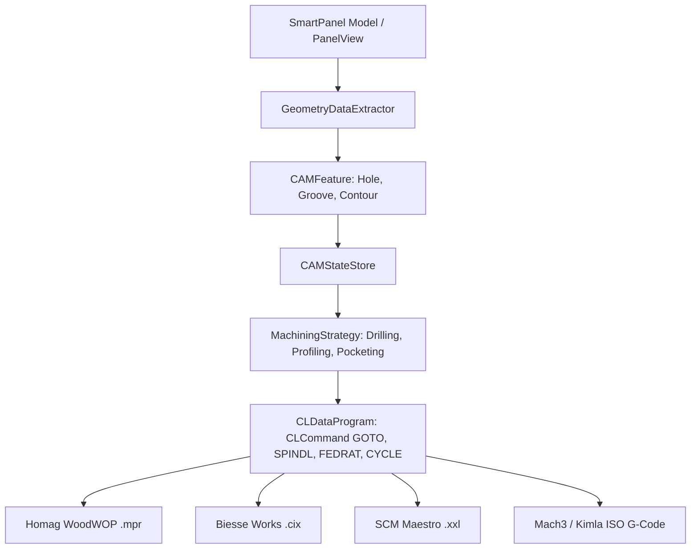

# Architektura Modułu CAM CNC (`C1_cnc`) — Przewodnik dla Agenta AI

Dokumentacja architektoniczna modułu `C1_cnc` stworzona z myślą o agentach AI i programistach rozwijających przemysłowy system CAM meblarskiego dla maszyn CNC (Homag WoodWOP, Biesse CIX, SCM Maestro, Mach3/Kimla, Fanuc).

---

## 1. Dedykowane Postprocesory Producentów Maszyn Meblarskich

Głównym celem modułu `C1_cnc` jest generowanie gotowych programów maszynowych dla **wiodących producentów obrabiarek CNC dla meblarstwa i stolarstwa**:

1. **Homag / Weeke WoodWOP** (`postprocessors/woodwop-postprocessor.ts`):
   - Generuje pliki w standardzie `.mpr` z makrami `\DrillingVertical` oraz `\Routing`.
2. **Biesse / BiesseWorks / bSolid** (`postprocessors/biesse-postprocessor.ts`):
   - Generuje pliki w standardzie `.cix` / `.bpp` (bloki `BG` dla nawiertów i `ROUT` dla frezowania).
3. **SCM / Morbidelli Xilog Maestro / Xilog Plus** (`postprocessors/scm-postprocessor.ts`):
   - Generuje pliki w standardzie `.xxl` / `.pgm` (nagłówek `H DX=... DY=... DZ=...`, makra `BORE` i `ROUT`).
4. **Mach3 / GRBL / InfoTEC / Kimla / Masterwood** (`postprocessors/mach3-postprocessor.ts`):
   - Generuje standardowy G-kod ISO DIN 66025 z cyklami G81 / G83 i bloki N10, N20...
5. **Fanuc / Haas CNC** (`postprocessors/fanuc-postprocessor.ts`):
   - Generuje G-kod z kompensacją długości narzędzia G43 i podprogramami.

---

## 2. Zasady Główne Architektury

1. **Niezależność od OCCT (B-Rep / Mesh)**:
   - System CAM nie wymaga ciężkiego kernela OCCT na froncie. Operuje na **algebraicznym modelu cech meblarskich** (`CAMFeature`: `HoleFeature`, `GrooveFeature`, `ContourFeature`) oraz natywnych punktach matematycznych `brepPoints`.
2. **Warstwa Kodowania Pośredniego (CLData - ISO 4343)**:
   - Operacje obróbcze **nigdy nie tworzą od razu napisów G-kodu**. Generują neutralną reprezentację pośrednią `CLDataProgram` (pliki w `core/cl-data.ts`).
   - Dedykowane postprocesory meblarskie (`postprocessors/`) tłumaczą `CLDataProgram` na pliki fabryczne maszyn.
3. **Wzorzec Strategii Obróbki (Machining Strategies)**:
   - Algorytmy przeliczania ścieżek narzędziowych są zamknięte we wzorcu *Strategy* (`strategies/base-strategy.ts`):
     - `DrillingStrategy`: Wiercenie cykliczne (G81) oraz głębokie z łamaniem wióra (G83 Peck Drilling),
     - `ProfilingStrategy`: Konturowanie 2.5D z najazdem po łuku (`leadIn`/`leadOut`), kompensacją promienia frezu (G41/G42) i przejściami głębokości (Stepdown),
     - `PocketingStrategy`: Wybór materiału z kieszeni i wpustów.
4. **Scentralizowany Magazyn Stanu (`CAMStateStore`)**:
   - Stan modułu CNC jest zarządzany przez singleton `CAMStateStore` w `core/cam-state-store.ts`.

---

## 3. Diagram Przepływu Danych (Pipeline CAM)

