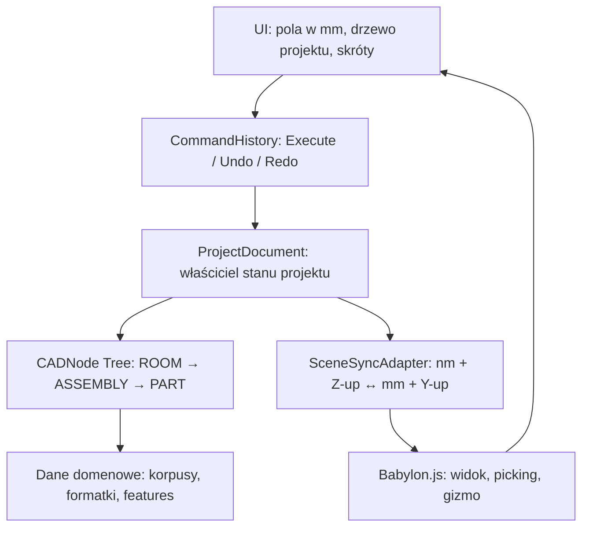

# Precyzyjny plan przejścia do ProjectDocument oraz Undo/Redo

## 1. Cel architektoniczny

Celem nie jest stworzenie kopii całego FreeCAD, lecz solidnego rdzenia dokumentowego dla webowego CAD/CAM meblowego.

Po migracji aplikacja ma działać według zasady:



Najważniejsza reguła:

> `ProjectDocument` jest jedynym właścicielem struktury i stanu domenowego. Babylon.js, UI, `ContainerModel.children` oraz listy widoków nie mogą być alternatywnymi źródłami prawdy.

---

## 2. Decyzje, które należy zatwierdzić przed implementacją

### 2.1 Jednostki

| Warstwa | Jednostka | Przykład szerokości korpusu |
|---|---:|---:|
| CADNode i modele domenowe | nm | `600_000_000` |
| Zapis projektu | nm | `600_000_000` |
| Panel właściwości i formularze | mm | `600` |
| Babylon.js | mm | `600` |
| G-Code metryczny | mm | `600` |
| G-Code imperialny | cale | `23.622...` |

Reguły:

- w domenie nie występują wartości mm;
- UI nigdy nie pokazuje użytkownikowi nm;
- `coord-system` obsługuje wyłącznie osie i skrętność;
- osobny moduł `units` obsługuje wyłącznie nm ↔ mm ↔ cale;
- wszystkie konwersje są wykonywane wyłącznie na granicach warstw.

### 2.2 Transformacje

- `CADNode.localMatrix` jest jedynym źródłem transformacji.
- Transformacja lokalna jest przechowywana w nm oraz jako kwaternion.
- `worldMatrix` jest wartością wyliczaną z rodzica.
- Euler pozostaje wyłącznie formatem kompatybilności dla starego UI i starych plików.
- Skalowanie nie jest narzędziem edycji mebli. Domyślnie wynosi `(1, 1, 1)`.

### 2.3 Struktura funkcjonalna

```text
ROOM
└── ASSEMBLY             Korpus / SmartFrame
    ├── PART             Bok lewy
    ├── PART             Bok prawy
    ├── PART             Półka
    └── PART             Plecy

ROOM
└── PART                 Wolna formatka
```

Na pierwszym etapie `FEATURE` pozostaje w `PanelModel.features[]`.

Nie twórz jeszcze osobnego `CADNode(FEATURE)` dla każdego otworu lub rowka. To jest wartościowy kolejny krok, ale nie jest potrzebny, aby uruchomić ProjectDocument i Undo/Redo.

---

## 3. Stan obecny i problem do usunięcia

Obecnie struktura projektu jest częściowo zdublowana:

| Miejsce | Aktualna rola | Problem |
|---|---|---|
| `ProjectModel.entities` | lista obiektów | nie opisuje pełnej hierarchii |
| `ContainerModel.children` | lista paneli korpusu | drugi stan relacji parent–child |
| `CADNode.children` | docelowe drzewo domenowe | jest podpinane częściowo podczas przebudowy widoku |
| Babylon `parent` | hierarchia renderu | nie może być właścicielem domeny |

Docelowo relacja „panel należy do korpusu” istnieje tylko tutaj:

```text
container._cadNode.children
```

`ContainerModel.children` może tymczasowo być wyliczaną fasadą kompatybilności, ale nie może być samodzielnie modyfikowane.

---

## 4. Model docelowy ProjectDocument

### 4.1 Nowy plik

`A1_core/project-document.ts`

### 4.2 Odpowiedzialność

`ProjectDocument`:

- posiada dokładnie jeden korzeń `ROOM`;
- jest właścicielem wszystkich CADNode;
- utrzymuje indeks `nodeId → CADNode`;
- zarządza dodawaniem, usuwaniem i przenoszeniem węzłów;
- emituje zdarzenia domenowe;
- śledzi zmiany niezapisane;
- zapisuje i odczytuje projekt;
- nie importuje Babylon.js, DOM ani komponentów UI.

### 4.3 Stan dokumentu

```text
ProjectDocument
  id
  name
  formatVersion
  domainUnit = "nm"
  rootNode: CADNode (ROOM)
  nodeIndex: Map<NodeId, CADNode>
  revision: number
  savedRevision: number
  eventSubscribers
```

### 4.4 Minimalne operacje dokumentu

| Operacja | Efekt |
|---|---|
| `addContainer` | tworzy ASSEMBLY i dodaje go do ROOM |
| `addPanel` | tworzy PART i dodaje go do ROOM albo ASSEMBLY |
| `removeNode` | usuwa węzeł razem z poddrzewem |
| `reparentNode` | zmienia rodzica z walidacją cyklu |
| `findNode` | zwraca węzeł po stabilnym ID |
| `getNodesByType` | zwraca kontenery lub formatki |
| `serialize` | zapisuje dokument |
| `load` | odczytuje, waliduje i migruje dokument |
| `markSaved` | oznacza aktualną rewizję jako zapisaną |

### 4.5 Inwarianty

Po każdej operacji muszą być prawdziwe następujące warunki:

1. Każdy CADNode, poza `ROOM`, ma dokładnie jednego rodzica.
2. W drzewie nie ma cykli.
3. Każde ID jest unikalne.
4. Każdy `PART` ma `PanelModel` jako `domainData`.
5. Każdy `ASSEMBLY` ma `ContainerModel` jako `domainData`.
6. `domainData._cadNode` wskazuje ten sam węzeł.
7. Żaden obiekt domenowy nie zawiera Babylon mesh.
8. Widok może zostać usunięty i odbudowany bez utraty danych dokumentu.
9. Po eksporcie i imporcie struktura oraz lokalne transformacje są identyczne.

---

## 5. Format zapisu projektu

### 5.1 Wersja dokumentu

Wprowadzić nową wersję formatu, np.:

```text
format: "smartpanel-project"
version: 2
domainUnit: "nm"
```

### 5.2 Co zapisujemy

Dla każdego CADNode:

- `id`
- `name`
- `nodeType`
- `parentId` albo struktura zagnieżdżona
- `translationNm`
- `rotationQuaternion`
- `scale`
- dane domenowe właściwe dla danego typu

Dla `PART`:

- wymiary w nm;
- rola panelu;
- materiał;
- features;
- metadane CNC.

Dla `ASSEMBLY`:

- wymiary w nm;
- `generatorParams`;
- parametry SmartFrame;
- metadane korpusu.

### 5.3 Czego nie zapisujemy

- Babylon mesh;
- stan gizmo;
- mapy adaptera;
- subskrypcje zdarzeń;
- historia Undo/Redo;
- wyliczone `worldMatrix`;
- `ContainerModel.children` jako osobne źródło relacji.

### 5.4 Migracja starych plików

Przy odczycie pliku wersji 1:

1. utwórz `ROOM`;
2. utwórz CADNode dla każdego kontenera;
3. utwórz CADNode dla każdego panelu;
4. panel z `ContainerModel.children` podłącz do odpowiedniego `ASSEMBLY`;
5. panel nieprzypisany do korpusu podłącz bezpośrednio do `ROOM`;
6. przekonwertuj Euler XYZ do kwaternionu;
7. zachowaj istniejące wartości jako nm;
8. zapisz projekt przy kolejnym eksporcie jako wersję 2.

---

## 6. Migracja bez ryzyka: fazy przejścia

## Faza A — Fundament dokumentu, bez zmiany UI

### Zakres

- utworzyć `ProjectDocument`;
- dodać korzeń `ROOM`;
- dodać indeks węzłów;
- dodać walidację ID, rodziców i cykli;
- zachować obecny `ProjectModel`.

### Wymaganie

Aplikacja działa dokładnie jak przed migracją.

### Kryterium odbioru

Można programowo stworzyć dokument z korpusem i panelami, bez Babylon.js.

---

## Faza B — ProjectModel jako fasada kompatybilności

### Zakres

`ProjectModel` nie znika. Staje się przejściową fasadą nad `ProjectDocument`.

| Stare użycie | Docelowe znaczenie |
|---|---|
| `entities` | projekcja korzeni dokumentu |
| `addEntity` | delegacja do `ProjectDocument` |
| `removeEntity` | delegacja do `ProjectDocument` |
| `activeEntity` | stan selekcji UI, nie stan struktury |
| `children` kontenera | widok dzieci CADNode, tylko do odczytu |

### Zakaz

Nie wolno równocześnie ręcznie modyfikować:

- `entities`,
- `ContainerModel.children`,
- `CADNode.children`.

Modyfikacja struktury odbywa się tylko przez `ProjectDocument`.

### Kryterium odbioru

Dodanie panelu przez stare API poprawnie tworzy relację CADNode.

---

## Faza C — app.ts staje się konsumentem dokumentu

### Zakres

`app.ts`:

- odczytuje obiekty przez przejście po `ProjectDocument.rootNode`;
- tworzy lub usuwa widoki tylko na podstawie tego drzewa;
- odtwarza Babylon parent–child zgodnie z CADNode;
- nie wywołuje `CADNode.addChild()` podczas renderowania;
- nie podejmuje decyzji, czy panel należy do korpusu.

### Zasada

`app.ts` może wykonać:

```text
„W dokumencie istnieje PART — upewnij się, że ma PanelView”.
```

`app.ts` nie może wykonać:

```text
„Ten PanelView wygląda jak dziecko ContainerView, więc dopnij go do domeny”.
```

### Kryterium odbioru

Usunięcie i ponowne utworzenie wszystkich widoków Babylon nie zmienia dokumentu ani struktury CADNode.

---

## Faza D — Jednostki na granicach

### Nowy moduł

`A1_core/cad-math/units.ts`

### Zakres

- nm ↔ mm;
- nm ↔ cale;
- formatowanie wartości dla UI;
- walidacja liczb skończonych;
- jawne zaokrąglenie do pełnego nm przy zapisie wartości z UI.

### Integracja

| Miejsce | Konwersja |
|---|---|
| pole „szerokość 600” | mm → nm |
| panel właściwości | nm → mm |
| SceneSyncAdapter do Babylon | nm → mm |
| SceneSyncAdapter z Babylon | mm → nm |
| generator G-Code w mm | nm → mm |
| generator G-Code w calach | nm → inch |

### Kryterium odbioru

Wartość `600 mm` w UI po serii edycji, undo, zapisie i ponownym odczycie nadal oznacza `600_000_000 nm` w domenie.

---

## 7. Architektura Undo/Redo

## 7.1 Najważniejsza zasada

Widok i UI nie zmieniają modeli bezpośrednio.

Każda trwała zmiana dokumentu przechodzi przez komendę:

```text
UI / Gizmo
  → Command
  → ProjectDocument
  → dokumentChanged
  → Babylon + UI odświeżają widok
```

## 7.2 Nowe moduły

```text
A1_core/commands/
  command.ts
  command-history.ts
  transform-node-command.ts
  set-dimensions-command.ts
  add-node-command.ts
  remove-node-command.ts
  reparent-node-command.ts
  add-feature-command.ts
  remove-feature-command.ts
```

## 7.3 Kontrakt komendy

Każda komenda posiada:

| Pole / operacja | Znaczenie |
|---|---|
| `id` | unikalny identyfikator komendy |
| `label` | tekst dla UI, np. „Przesuń bok lewy” |
| `execute` | wykonuje zmianę |
| `undo` | odwraca zmianę |
| `redo` | ponawia zmianę |
| `affectedNodeIds` | ułatwia odświeżanie |
| `timestamp` | pozwala scalać edycje tekstowe |

Komenda nie może odwoływać się do Babylon mesh.

## 7.4 CommandHistory

Stan:

```text
undoStack
redoStack
maxEntries = 100
activeInteractiveTransaction
```

Reguły:

1. `execute(command)` wykonuje komendę i dodaje ją do `undoStack`.
2. `undo()` cofa ostatnią komendę i przenosi ją do `redoStack`.
3. `redo()` wykonuje ponownie ostatnią cofniętą komendę.
4. Wykonanie nowej komendy po Undo czyści `redoStack`.
5. Historia ma maksymalnie 100 kroków.
6. Operacje ładowania projektu nie trafiają do historii.
7. Zapis projektu nie czyści historii.
8. Dokument oznacza stan „zmieniony”, gdy `revision !== savedRevision`.

---

## 8. Dokładne komendy pierwszej wersji

### 8.1 TransformNodeCommand

Dotyczy przesunięcia i obrotu.

Przechowuje:

- ID węzła;
- lokalną transformację przed zmianą;
- lokalną transformację po zmianie.

Undo nie oblicza transformacji ponownie. Po prostu przywraca dokładną transformację „before”.

To jest ważne, ponieważ zapewnia identyczny wynik mimo rotacji rodziców, zmiany osi renderu lub przebudowy widoku.

### 8.2 SetDimensionsCommand

Przechowuje:

- ID panelu lub korpusu;
- stare wymiary w nm;
- nowe wymiary w nm;
- poprzednie i nowe parametry generatora, jeśli zmiana dotyczy SmartFrame.

Po wykonaniu:

1. aktualizuje model domenowy;
2. oznacza generator jako dirty;
3. uruchamia kontrolowaną przebudowę geometrii;
4. wysyła jedno zdarzenie dokumentu.

### 8.3 AddNodeCommand

Przechowuje:

- snapshot nowego poddrzewa;
- ID rodzica;
- indeks wśród dzieci.

Undo usuwa dokładnie dodane poddrzewo.

### 8.4 RemoveNodeCommand

Przechowuje:

- pełny snapshot usuniętego poddrzewa;
- ID poprzedniego rodzica;
- indeks wśród dzieci.

Undo przywraca obiekt w tym samym miejscu drzewa.

### 8.5 ReparentNodeCommand

Przechowuje:

- ID węzła;
- stary rodzic i indeks;
- nowy rodzic i indeks;
- tryb zachowania transformacji:

| Tryb | Znaczenie |
|---|---|
| `keepLocal` | węzeł zachowuje lokalną transformację |
| `keepWorld` | węzeł pozostaje w tym samym miejscu sceny |

Dla UI „przeciągnij panel do innego korpusu” domyślnie używać `keepWorld`.

### 8.6 Feature commands

Pierwsza wersja pracuje na `PanelModel.features[]`.

- `AddFeatureCommand` zapisuje kompletne dane feature.
- `RemoveFeatureCommand` zapisuje usunięty feature i jego indeks.
- edycja parametrów feature używa `UpdateFeatureCommand`.

---

## 9. Gizmo i modal transform

## 9.1 Przeciąganie gizmo

Jedno przeciągnięcie musi dawać dokładnie jeden wpis historii.

```text
PointerDown
  → odczyt localMatrixBefore
  → rozpoczęcie transakcji interaktywnej

PointerMove
  → tymczasowa aktualizacja CADNode
  → SceneSyncAdapter odświeża Babylon
  → brak wpisu Undo

PointerUp
  → odczyt localMatrixAfter
  → jeśli before ≠ after:
      zapisz TransformNodeCommand
  → jeśli before = after:
      anuluj transakcję
```

### 9.2 Anulowanie

Naciśnięcie `Escape` podczas przeciągania:

- przywraca `localMatrixBefore`;
- nie tworzy wpisu Undo;
- odświeża Babylon przez adapter.

### 9.3 Modal transform

Modal transform nie ustawia ręcznie `targetNode.position.x/y/z`.

Powinien:

1. obliczyć zmianę w przestrzeni renderu;
2. przekazać ją przez adapter oraz konwersję mm ↔ nm;
3. zmienić CADNode;
4. po zatwierdzeniu zapisać pojedynczą komendę.

---

## 10. Zdarzenia i recompute

## 10.1 Zdarzenia dokumentu

`ProjectDocument` emituje małe, opisowe zdarzenia:

| Typ | Kiedy |
|---|---|
| `nodeAdded` | dodano CADNode |
| `nodeRemoved` | usunięto CADNode |
| `nodeReparented` | zmieniono rodzica |
| `transformChanged` | zmieniono lokalną transformację |
| `dimensionsChanged` | zmieniono wymiary |
| `featuresChanged` | zmieniono obróbkę |
| `documentLoaded` | wczytano projekt |
| `documentChanged` | zdarzenie zbiorcze po komendzie |

W pierwszej wersji wystarczy jedno zbiorcze `documentChanged` wraz z listą zmienionych ID.

## 10.2 SmartFrame recompute

Zmiana parametrów generatora nie może przebudowywać wszystkiego przy każdym ruchu gizmo.

Zasada:

- przesunięcie korpusu: tylko transformacja, bez generowania paneli;
- zmiana szerokości/głębokości/wysokości: oznacza `ASSEMBLY` jako dirty;
- po zatwierdzeniu komendy uruchamia się `recomputeAssembly`;
- generator aktualizuje tylko panele należące do danego korpusu.

Docelowo SmartFrame powinien być deterministyczny:

```text
te same generatorParams + te same wymiary
= te same role paneli i stabilne ID
```

To jest konieczne, aby Undo/Redo nie gubiło selekcji, features ani powiązań CNC.

---

## 11. Plan implementacji w kolejności

### Etap 0 — zabezpieczenie

- naprawić błędy TypeScript;
- zatwierdzić nm jako jednostkę domeny;
- dodać moduł jednostek;
- nie ruszać jeszcze CNC/WCS.

**Bramka:** `tsc --noEmit` przechodzi.

### Etap 1 — ProjectDocument

- utworzyć `ProjectDocument`;
- utworzyć `ROOM`;
- indeks ID;
- operacje add/remove/reparent/find;
- walidacja struktury.

**Bramka:** dokument działa bez Babylon.js.

### Etap 2 — fasada kompatybilności

- podłączyć `ProjectModel.document`;
- przekierować dodawanie i usuwanie obiektów;
- zachować stare API dla UI;
- oznaczyć `ContainerModel.children` jako read-only projection.

**Bramka:** obecny UI nadal dodaje korpusy i panele, ale struktura istnieje w CADNode.

### Etap 3 — widok z dokumentu

- `app.ts` przechodzi po ProjectDocument;
- tworzy i usuwa `PanelView` / `ContainerView`;
- Babylon parent–child wynika z CADNode;
- brak domenowych zmian wykonywanych przez warstwę renderu.

**Bramka:** usunięcie widoku i ponowne renderowanie nie zmienia drzewa domenowego.

### Etap 4 — CommandHistory i transformacje

- `CommandHistory`;
- `TransformNodeCommand`;
- transakcja przeciągania gizmo;
- skróty `Ctrl+Z`, `Ctrl+Y`, `Ctrl+Shift+Z`.

**Bramka:** przesunięcie i obrót panelu lub korpusu można cofnąć i ponowić bez „skoków” sceny.

### Etap 5 — wymiary i generator

- `SetDimensionsCommand`;
- kontrolowany recompute SmartFrame;
- stabilne ID paneli generowanych.

**Bramka:** zmiana wymiaru korpusu oraz Undo odtwarzają prawidłowe panele i ich features.

### Etap 6 — struktura i features

- Add/Remove/Reparent node;
- Add/Remove/Update feature;
- Undo dla usuwania panelu i otworu.

**Bramka:** cofnięcie usunięcia przywraca obiekt, jego dane i pozycję w drzewie.

### Etap 7 — format projektu v2

- zapis ProjectDocument;
- import v1 → migracja;
- walidacja i raport błędów importu.

**Bramka:** projekt po zapisie i odczycie ma identyczne drzewo, nm i transformacje.

---

## 12. Testy wymagane przed uznaniem migracji za zakończoną

### Domenowe

- unikalność ID;
- wykrywanie cyklu;
- reparent `keepLocal`;
- reparent `keepWorld`;
- serializacja/deserializacja drzewa;
- import starego pliku;
- transformacja rodzic + dziecko;
- nm ↔ mm ↔ nm;
- nm ↔ inch ↔ nm.

### Undo/Redo

- przesunięcie panelu;
- obrót korpusu z panelami;
- zmiana wymiaru;
- dodanie i usunięcie panelu;
- dodanie i usunięcie otworu;
- 20 kolejnych undo;
- 20 kolejnych redo;
- nowa akcja po undo czyści redo;
- anulowanie gizmo przez Escape nie zapisuje historii.

### Integracyjne

- render po przebudowie;
- selekcja zachowana po Undo;
- zapis, odczyt, render;
- dokument działa bez Babylon.js;
- G-Code dla tej samej formatki przed i po zapisie daje tę samą geometrię w mm.

---

## 13. Czego nie robić w tym cyklu

- nie tworzyć pełnego systemu „workbenchów”;
- nie dodawać timeline historii jak w FreeCAD;
- nie zapisywać historii undo do pliku;
- nie przenosić wszystkich features do CADNode;
- nie migrować jeszcze całego CNC/WCS;
- nie usuwać starego ProjectModel, zanim fasada nie przejdzie testów;
- nie wprowadzać dodatkowych jednostek do domeny.

## Definicja sukcesu

Po tym etapie aplikacja posiada profesjonalny rdzeń:

- jeden dokument domenowy;
- jedno drzewo obiektów;
- transformacje niezależne od Babylon.js;
- dane w nm, UI i scena w mm;
- bezpieczne Undo/Redo;
- stabilny zapis projektu;
- gotową podstawę pod parametryczny SmartFrame i CNC.