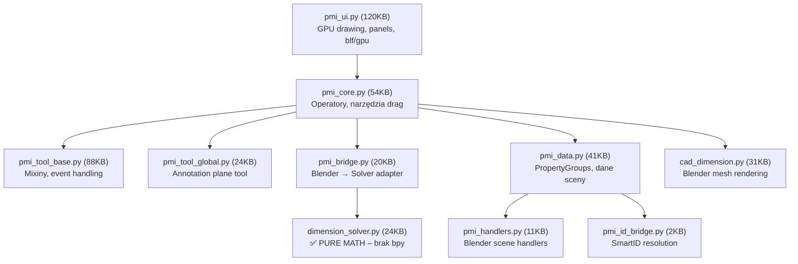
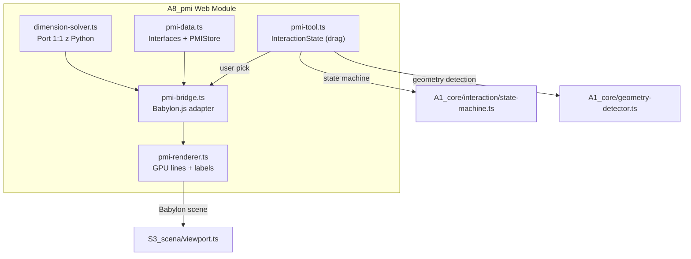

# Przeniesienie A8_pmi (Wymiarowanie) do aplikacji Web

Moduł `@@BLENDER/A8_pmi` to kompletny system wymiarowania CAD (~400KB kodu Python). Analiza pokazuje, że **jest go możliwe przenieść**, ale wymaga to przepisania na TypeScript z adaptacją do Babylon.js. Moduł ma wyraźną architekturę warstwową, z której **warstwa matematyczna (solver) jest w 100% przenoszalna**.

## Architektura modułu Blenderowego (obecna)



## Warstwy — Co się przenosi, co trzeba przepisać

| Warstwa | Plik źródłowy | Zależność od Blender | Strategia |
|---|---|---|---|
| **Solver matematyczny** | `dimension_solver.py` | ❌ Brak (`mathutils.Vector` → `BABYLON.Vector3`) | **Bezpośredni port 1:1** do TS |
| **Geometria / text metrics** | `dimension_solver.py` + `geometry_utils.py` | ❌ Minimalna | **Port 1:1** |
| **Model danych PMI** | `pmi_data.py` | ✅ Pełna (PropertyGroup, PointerProperty) | **Przepisać** jako TS interfaces/classes |
| **Bridge / adapter** | `pmi_bridge.py` | ✅ `Matrix`, `Vector`, Blender objects | **Przepisać** → Babylon.js meshes |
| **Narzędzia interaktywne** | `pmi_tool_base.py`, `pmi_core.py` | ✅ Pełna (bpy.types.Operator, modal, bmesh) | **Nowy kod** jako InteractionState |
| **Rendering UI** | `pmi_ui.py` | ✅ Pełna (gpu, blf, shader) | **Nowy kod** → Babylon.js Lines/GUI |
| **3D mesh wymiaru** | `cad_dimension.py` | ✅ Pełna (bpy.data.meshes) | **Nowy kod** → Babylon.js meshes |

## Proponowana architektura Web (folder `web/A8_pmi/`)



---

## Proposed Changes

### Warstwa 1: Solver matematyczny (PURE PORT)

#### [NEW] [dimension-solver.ts](file:///c:/Users/ADM/AppData/Roaming/Blender%20Foundation/Blender/5.0/scripts/addons/CAD/web/A8_pmi/dimension-solver.ts)
Port 1:1 z `dimension_solver.py`. Zamiana `mathutils.Vector` → `BABYLON.Vector3`, `mathutils.Matrix` → `BABYLON.Matrix`. Obejmuje:
- Enumy: `FrameSource`, `HelperPolicy`, `ArrowMode`, `StatusCode`, `FallbackReason`
- Dataclasses → TS interfaces: `ProjectionFrame`, `SelectionInput`, `SolverConfig`, `SolverResult`, `ArrowPlacementResult`
- Funkcje: `solve_dimension()`, `solve_arrow_placement()`, `compute_text_metrics()`

#### [NEW] [geometry-utils.ts](file:///c:/Users/ADM/AppData/Roaming/Blender%20Foundation/Blender/5.0/scripts/addons/CAD/web/A8_pmi/geometry-utils.ts)
Port z `geometry_utils.py` + `pmi_math_utils.py`:
- `closestPointOnFace()`, `clampPointToSegment()`, `snapPointToEdgeEndpoint()`, `snapPointToFaceCorner()`
- `suggestDefaultAxis()`, `suggestMeasurementAxis()`

---

### Warstwa 2: Model danych

#### [NEW] [pmi-data.ts](file:///c:/Users/ADM/AppData/Roaming/Blender%20Foundation/Blender/5.0/scripts/addons/CAD/web/A8_pmi/pmi-data.ts)
- `PMIAnnotation` interface — odpowiednik `PMIAnnotationProperty` (p1/p2 local, distance, axis, text, visible, selected)
- `PMINote` interface — odpowiednik `PMINoteProperty`
- `PMIMeasurement` interface — odpowiednik `PMIMeasurementProperty`
- `PMIStore` class — singleton zarządzający kolekcjami (add/remove/select/toggle), odpowiednik `pmi_data.py` helper functions
- Integracja z istniejącym `unit-system.ts` (zamiast `format_distance()`)

---

### Warstwa 3: Bridge + Rendering

#### [NEW] [pmi-bridge.ts](file:///c:/Users/ADM/AppData/Roaming/Blender%20Foundation/Blender/5.0/scripts/addons/CAD/web/A8_pmi/pmi-bridge.ts)
Adapter Babylon.js → Solver. Zamiana logiki z `pmi_bridge.py`:
- `solveDimensionBridge()` — buduje `SelectionInput` z Babylon meshes i wywołuje solver
- `getRenderData()` → `BridgeRenderData` z world-space geometry
- `iterHelperLineSegments()` — generuje segmenty linii pomocniczych

#### [NEW] [pmi-renderer.ts](file:///c:/Users/ADM/AppData/Roaming/Blender%20Foundation/Blender/5.0/scripts/addons/CAD/web/A8_pmi/pmi-renderer.ts)
Rendering wymiarów w Babylon.js (zamiast `pmi_ui.py` gpu/blf + `cad_dimension.py` mesh):
- Linie wymiarowe i pomocnicze via `BABYLON.LinesBuilder` lub `BABYLON.LinesMesh`
- Groty strzałek via triangulated mesh
- Etykiety tekstowe via Babylon.js GUI `TextBlock` (Advanced Dynamic Texture)
- Kolorowanie: domyślny (biały/szary), zaznaczony (pomarańczowy), edycja (cyjan)
- Live preview podczas dragowania

---

### Warstwa 4: Narzędzie interaktywne (Tool)

#### [NEW] [pmi-tool.ts](file:///c:/Users/ADM/AppData/Roaming/Blender%20Foundation/Blender/5.0/scripts/addons/CAD/web/A8_pmi/pmi-tool.ts)
Nowy `InteractionState` dla state-machine (analogicznie do `draw-line-tool.ts`, `extrude-tool.ts`):
- Stany: `IDLE` → `PICK_P1` → `DRAG_P2` → `ADJUST_OFFSET` → `CONFIRM`
- Wykorzystuje `GeometryDetector` do przyciągania do wierzchołków/krawędzi/ścian
- RMB / Esc = anuluj, Enter / LMB = potwierdź
- Kamera (MMB) działa niezależnie — zgodnie z zasadą z `AGENTS.md`

#### [MODIFY] [state-machine.ts](file:///c:/Users/ADM/AppData/Roaming/Blender%20Foundation/Blender/5.0/scripts/addons/CAD/web/A1_core/interaction/state-machine.ts)
Dodanie stanu `DIMENSION_TOOL` do rejestru narzędzi.

---

## Open Questions

> [!IMPORTANT]
> **Zakres MVP vs Full Port**: Moduł Blenderowy ma ~400KB kodu (Python). Pełny port to duże zadanie. Proponuję fazowanie:
> - **Faza 1 (MVP)**: Solver + prosty wymiar punkt-punkt z renderingiem linii 2D overlay — **~3-4 pliki, ~1500 LOC TS**
> - **Faza 2**: Annotation Plane (narzędzie 7), notatki gabarytowe, miarki
> - **Faza 3**: Pełna edycja (double-click, drag offset, prefix/suffix)
>
> Czy zaczynamy od Fazy 1?

> [!IMPORTANT]
> **Rendering strategy**: Babylon.js oferuje dwa podejścia:
> 1. **Meshes 3D** (jak `cad_dimension.py`) — wymiary jako fizyczne obiekty w scenie 3D, skalowane z kamerą
> 2. **GUI Overlay** (AdvancedDynamicTexture) — wymiary rysowane w 2D na canvasie, zawsze czytelne
>
> Blender używa hybrydy (mesh 3D + blf overlay). Czy preferujesz podejście hybrydowe, czy pure 3D?

> [!IMPORTANT]  
> **Jakie narzędzia wymiarowania przenieść najpierw?**
> - `pmi_cad_drag_smart` (LOCAL) — wymiar z ręcznym wyborem osi
> - `pmi_annotation_plane_drag` (GLOBAL) — wymiar na płaszczyźnie adnotacyjnej  
> - `pmi_cad_drag_aligned` (ALIGNED) — wymiar równoległy do krawędzi
> - `pmi_point_drag` (Measurement/Miarka) — najprostszy, punkt-punkt

## Verification Plan

### Automated Tests
```bash
cd web && npx vitest run A8_pmi/
```
- Unit testy solvera (port z Pythona — te same wektory wejściowe, te same wyniki)
- Test integracyjny: stworzenie wymiaru programistycznie i weryfikacja geometrii renderingu

### Manual Verification
- Uruchomienie `npm run dev`, kliknięcie narzędzia wymiarowania w toolbarze
- Przeciągnięcie między dwoma krawędziami panelu → weryfikacja live preview + finalny wymiar
- Sprawdzenie poprawności tekstu (mm), grotów strzałek, linii pomocniczych
