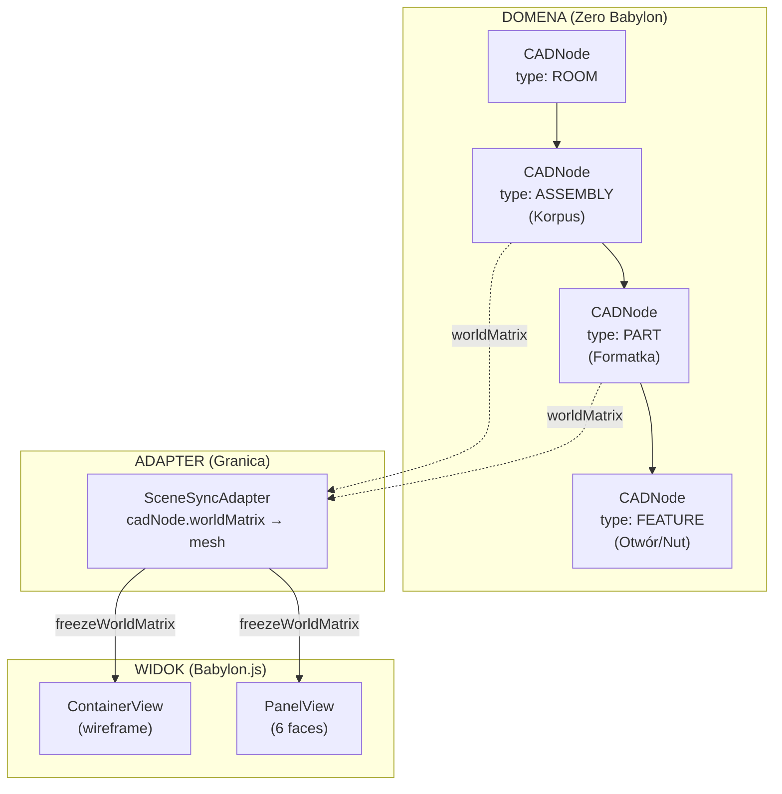

# Refaktoryzacja CADNode — Separacja Domeny CAD od Babylon.js

## Kontekst

Celem jest przejście z obecnej architektury, w której logika CAD i renderowanie Babylon.js są silnie splecione, do docelowej architektury **CADNode** — czystego, domenowego drzewa węzłów operującego wyłącznie na algebrze macierzowej 4×4 i kwaternionach, z Babylon.js jako pasywnym widokiem (View Adapter).

---

## 1. GAP ANALYSIS — Obecny stan vs. Cel

### 1.1 Mapa Zanieczyszczeń (Babylon.js ↔ Domena CAD)

Poniższa tabela identyfikuje **każde miejsce**, w którym logika domenowa CAD jest bezpośrednio powiązana z silnikiem renderowania:

| # | Plik | Linie | Rodzaj zanieczyszczenia | Krytyczność |
|---|------|-------|------------------------|-------------|
| **G1** | [panel-view.ts](file:///c:/Users/ADM/AppData/Roaming/Blender%20Foundation/Blender/5.0/scripts/addons/CAD/web/A4_smartpanel/panel-view.ts#L94-L108) | 94-108 | `_updateTransform()` czyta `model.position` / `model.rotation` i **ręcznie konstruuje** `BABYLON.Vector3`. Brak macierzy, brak hierarchii rodzica. | 🔴 Wysoka |
| **G2** | [container-view.ts](file:///c:/Users/ADM/AppData/Roaming/Blender%20Foundation/Blender/5.0/scripts/addons/CAD/web/A3_smartframe/container-view.ts#L66-L74) | 66-74 | `_buildWireframe()` ustawia `mesh.position` z `model.position`, a następnie **bake'uje offset `Y/2` do wierzchołków** (`bakeTransformIntoVertices`). To _sprzęga_ pivot z konkretnym silnikiem graficznym. | 🔴 Wysoka |
| **G3** | [gizmo-controller.ts](file:///c:/Users/ADM/AppData/Roaming/Blender%20Foundation/Blender/5.0/scripts/addons/CAD/web/A1_core/gizmo-controller.ts#L296-L330) | 296-330 | Gizmo Position: Synchronizacja `targetNode.position` ↔ `activeEntity.position` z **ręczną zamianą osi Y↔Z** (`CAD Y = 3D Z`, `CAD Z = 3D Y`). Powtórzone 4 razy w pliku! | 🔴 Krytyczna |
| **G4** | [modal-transform.ts](file:///c:/Users/ADM/AppData/Roaming/Blender%20Foundation/Blender/5.0/scripts/addons/CAD/web/A1_core/modal-transform.ts#L236-L244) | 236-244 | Przeliczanie ruchu 2D→3D z **hardkodowaną zamianą osi** (`CAD Y = Głębokość (3D Z)`, `CAD Z = Wysokość (3D Y)`). | 🔴 Krytyczna |
| **G5** | [smartframe-adapter.ts](file:///c:/Users/ADM/AppData/Roaming/Blender%20Foundation/Blender/5.0/scripts/addons/CAD/web/A3_smartframe/smartframe-adapter.ts#L170-L200) | 170-200 | `applyPlanToContainer()`: Ręczna zamiana osi `loc.x → localCenterX`, `loc.z → localCenterY`, `loc.y → localCenterZ` + hardkodowane kąty Eulera (`Math.PI/2`) per rola panelu. | 🔴 Krytyczna |
| **G6** | [project-model.ts](file:///c:/Users/ADM/AppData/Roaming/Blender%20Foundation/Blender/5.0/scripts/addons/CAD/web/A1_core/project-model.ts#L37-L51) | 37-51 | `ContainerModel` przechowuje `position`/`rotation` jako płaski `Vector3D {x,y,z}` — brak macierzy lokalnej, brak referencji do rodzica, brak propagacji transformacji. | 🟠 Średnia |
| **G7** | [panel-model.ts](file:///c:/Users/ADM/AppData/Roaming/Blender%20Foundation/Blender/5.0/scripts/addons/CAD/web/A4_smartpanel/panel-model.ts#L47-L48) | 47-48 | `PanelModel.position`/`rotation` jako `{x,y,z}` — kąty Eulera, bez kwaternionów, bez macierzy LCS→WCS. | 🟠 Średnia |
| **G8** | [wcs-manager.ts](file:///c:/Users/ADM/AppData/Roaming/Blender%20Foundation/Blender/5.0/scripts/addons/CAD/web/C1_cnc/wcs/wcs-manager.ts#L124-L158) | 124-158 | `transformVector()` wykonuje rotację punkt-po-punkcie kątami Eulera X→Y→Z ręcznie (3 × sin/cos). Podatne na Gimbal Lock, brak możliwości kaskadowego mnożenia macierzy. | 🟠 Średnia |
| **G9** | [app.ts](file:///c:/Users/ADM/AppData/Roaming/Blender%20Foundation/Blender/5.0/scripts/addons/CAD/web/A1_core/app.ts#L96-L144) | 96-144 | `rebuildGeometry()` manualnie zarządza hierarchią parent–child (`view.root.setParent(containerView.rootNode)`) — logika drzewa żyje w renderze, nie w domenie. | 🟠 Średnia |
| **G10** | [panel-view.ts](file:///c:/Users/ADM/AppData/Roaming/Blender%20Foundation/Blender/5.0/scripts/addons/CAD/web/A4_smartpanel/panel-view.ts#L297-L333) | 297-333 | `_buildMeshes()` oblicza pozycje ścian (`[0, 0, t/2]`) i kąty Eulera (`[0, Math.PI, 0]`) jako stałe literały — geometria renderingu zakodowana na sztywno. | 🟡 Niska |

---

### 1.2 Wzorce Anty-Architektoniczne (Anti-Patterns)

#### 🔴 AP-1: Ręczna zamiana osi Y↔Z (Axis Swizzling)

**Występuje w**: G3 (×4), G4, G5

```
// Powtórzony wzorzec w co najmniej 6 miejscach:
activeEntity.position = {
    x: Math.round(targetNode.position.x),
    y: Math.round(targetNode.position.z),  // CAD Y = 3D Z
    z: Math.round(targetNode.position.y)   // CAD Z = 3D Y
};
```

**Problem**: Babylon.js używa Y-up, domena CAD używa Z-up (zgodnie z CNC/Blenderem). Zamiana jest rozproszona po 6+ plikach zamiast być skoncentrowana w jednym adapterze. Każda nowa funkcja musi „pamiętać" o zamianie.

#### 🔴 AP-2: Brak kaskadowej propagacji macierzy (No Matrix Cascade)

**Występuje w**: G6, G7, G9

Hierarchia `ROOM → ASSEMBLY → PART → FEATURE` nie posiada matematycznego mechanizmu kaskady. Pozycje i rotacje są przechowywane jako płaskie `{x,y,z}`, więc:
- **Brak `worldMatrix`**: Nie da się obliczyć $M_{world} = M_{parent} \times M_{local}$ — trzeba ręcznie delegować pozycję z kontenera na dziecko.
- **Brak odwrotności**: Nie da się wyliczyć `M_local = M_parent^{-1} × M_world` — potrzebne do konwersji pick-point → lokalne UV.

#### 🟠 AP-3: Kąty Eulera zamiast kwaternionów/macierzy

**Występuje w**: G5, G7, G8

Obroty przechowywane jako `{x, y, z}` radiany. Przy złożeniach z wieloma obrotami (np. mebel obrócony o 45° + panel obrócony o 90°) kolejność aplikacji osi nie jest jawna, ryzyko Gimbal Lock.

#### 🟠 AP-4: Drzewo obiektów odtwarzane w warstwie View

**Występuje w**: G9

Funkcja `rebuildGeometry()` w `app.ts` ręcznie przeszukuje `projectModel → children`, znajduje `containerView`, a potem `view.root.setParent(containerView.rootNode)`. To jest logika **drzewa sceny** — powinna żyć w domenie, nie w render-loop.

---

### 1.3 Co Już Działa Dobrze ✅

| Element | Ocena | Plik |
|---------|-------|------|
| Separacja modelu od widoku (PanelModel ↔ PanelView) | ✅ Dobra — Model nie importuje BABYLON | [panel-model.ts](file:///c:/Users/ADM/AppData/Roaming/Blender%20Foundation/Blender/5.0/scripts/addons/CAD/web/A4_smartpanel/panel-model.ts) |
| SmartFrame Core — czysta matematyka | ✅ Doskonała — zero zależności od Babylon | [smartframe-core.ts](file:///c:/Users/ADM/AppData/Roaming/Blender%20Foundation/Blender/5.0/scripts/addons/CAD/web/A3_smartframe/smartframe-core.ts) |
| CNC Geometry Utils — czysta algebra wektorowa | ✅ Doskonała — `Vector3D` domenowy, zero BABYLON | [cnc-geometry-utils.ts](file:///c:/Users/ADM/AppData/Roaming/Blender%20Foundation/Blender/5.0/scripts/addons/CAD/web/C1_cnc/geometry/cnc-geometry-utils.ts) |
| LCS na PanelModel (`getLCS()`, `computeFaceData()`) | ✅ Dobra — czysta geometria | [panel-model.ts](file:///c:/Users/ADM/AppData/Roaming/Blender%20Foundation/Blender/5.0/scripts/addons/CAD/web/A4_smartpanel/panel-model.ts#L24-L37) |
| Project Schema (SSOT) | ✅ Dobra — typy TransformJSON definiują `loc`/`rot` | [project-schema.ts](file:///c:/Users/ADM/AppData/Roaming/Blender%20Foundation/Blender/5.0/scripts/addons/CAD/web/A1_core/project-schema.ts) |
| InteractionManager — separacja Camera/Tool | ✅ Zgodna z AGENTS.md — two-track architecture | [interaction-manager.ts](file:///c:/Users/ADM/AppData/Roaming/Blender%20Foundation/Blender/5.0/scripts/addons/CAD/web/A1_core/interaction) |

---

## 2. PROPONOWANY PLAN REFAKTORYZACJI

### Architektura Docelowa



---

### FAZA 0: Fundament Matematyczny (Nieblokujący — warstwa pod spodem)

> **Cel**: Stworzyć warstwę `cad-math` z czystą algebrą 4×4, niezależną od BABYLON.

#### [NEW] `A1_core/cad-math/mat4.ts`
- Klasa `Mat4` — macierz 4×4 (Float64Array):
  - `static identity()`, `static fromTranslation(x,y,z)`, `static fromQuaternion(q)`, `static fromTRS(t,r,s)`
  - `multiply(other)`, `invert()`, `decompose() → {translation, rotation, scale}`
  - `transformPoint(v3)`, `transformDirection(v3)` 

#### [NEW] `A1_core/cad-math/quat.ts`
- Klasa `Quat` — kwaternion:
  - `static fromEulerXYZ(rx,ry,rz)`, `static fromAxisAngle(axis,angle)`
  - `multiply(other)`, `inverse()`, `toMat4()`
  - Konwersja `toEuler()` — tylko na potrzeby interfejsu użytkownika

#### [NEW] `A1_core/cad-math/vec3.ts`
- Klasa `Vec3` ujednolicona z istniejącym `Vector3D` z `cnc-geometry-utils.ts`
- `dot()`, `cross()`, `length()`, `normalize()`, `transformByMat4(m)`

#### [NEW] `A1_core/cad-math/coord-system.ts`
- `cadToRender(v: Vec3): Vec3` — pojedyncze miejsce konwersji Z-up → Y-up
- `renderToCAD(v: Vec3): Vec3` — odwrotna konwersja
- `cadMatrixToRenderMatrix(m: Mat4): Mat4` — zamiana osi w macierzy

> **Kluczowy zysk**: Cała zamiana osi Y↔Z (AP-1) zamknięta w jednym pliku. Zero zmian w istniejącym kodzie na tym etapie.

---

### FAZA 1: CADNode — Rdzeń Drzewa (Additive — nie psuje istniejącego kodu)

#### [NEW] `A1_core/cad-node/cad-node.ts`

Szkielet interfejsu:

```
CADNode {
    // === Identyfikacja ===
    id: string
    name: string
    nodeType: NodeType  // ROOM | ASSEMBLY | PART | FEATURE
    
    // === Drzewo ===
    parent: CADNode | null
    children: CADNode[]
    
    // === Transformacja lokalna (LCS) ===
    localMatrix: Mat4           // Single Source of Truth
    
    // === Cache macierzy świata (WCS) ===
    worldMatrix: Mat4           // = parent.worldMatrix × localMatrix
    _worldMatrixDirty: boolean  // Flaga brudności
    
    // === Dane domenowe ===
    domainData: ContainerModel | PanelModel | FeatureData | null
    
    // === API ===
    setLocalTransform(t: Vec3, q: Quat, s?: Vec3): void
    getWorldMatrix(): Mat4      // Lazy recompute
    addChild(child: CADNode): void
    removeChild(child: CADNode): void
    findByType(type: NodeType): CADNode[]
    
    // === Zdarzenia ===
    onWorldMatrixChanged: Observable<Mat4>
}
```

#### [NEW] `A1_core/cad-node/node-type.ts`

```
enum NodeType {
    ROOM,       // Scena/Pokój — korzeń
    ASSEMBLY,   // Złożenie (Korpus, SmartFrame)
    PART,       // Formatka (PanelModel)
    FEATURE,    // Otwór, rowek, frez
    WCS_FRAME   // Układ bazowy maszyny CNC
}
```

#### Mechanika propagacji:

```
setLocalTransform(t, q, s?) {
    this.localMatrix = Mat4.fromTRS(t, q, s || Vec3.ONE)
    this._invalidateWorldMatrix()      // → propaguje w dół
}

_invalidateWorldMatrix() {
    if (this._worldMatrixDirty) return  // Already dirty
    this._worldMatrixDirty = true
    for (const child of this.children) {
        child._invalidateWorldMatrix()  // Kaskada w dół
    }
}

getWorldMatrix(): Mat4 {
    if (this._worldMatrixDirty) {
        this.worldMatrix = this.parent
            ? this.parent.getWorldMatrix().multiply(this.localMatrix)
            : this.localMatrix.clone()
        this._worldMatrixDirty = false
    }
    return this.worldMatrix
}
```

---

### FAZA 2: SceneSyncAdapter — Most Domena↔Render

#### [NEW] `A1_core/cad-node/scene-sync-adapter.ts`

```
SceneSyncAdapter {
    nodeToMesh: Map<CADNode, BABYLON.TransformNode>
    
    // Subskrybuje onWorldMatrixChanged na każdym CADNode
    bind(node: CADNode, mesh: BABYLON.TransformNode): void
    unbind(node: CADNode): void
    
    // Callback wywoływany gdy domena zmieni macierz
    _syncToRender(node: CADNode) {
        const mesh = this.nodeToMesh.get(node)
        if (!mesh) return
        
        // Konwersja CAD (Z-up) → Babylon (Y-up)
        const renderMatrix = coordSystem.cadMatrixToRenderMatrix(
            node.getWorldMatrix()
        )
        
        // KLUCZ: Babylon nie decyduje — tylko odbiera gotową macierz
        mesh.freezeWorldMatrix(renderMatrix.toBabylonMatrix())
    }
    
    // Odwrotna synchronizacja (Gizmo → Domena)
    syncFromRender(mesh: BABYLON.TransformNode): void {
        const node = this.meshToNode.get(mesh)
        if (!node) return
        
        const babylonMatrix = mesh.getWorldMatrix()
        const cadMatrix = coordSystem.renderMatrixToCADMatrix(babylonMatrix)
        const local = node.parent 
            ? node.parent.getWorldMatrix().invert().multiply(cadMatrix)
            : cadMatrix
        node.setLocalMatrixDirect(local)
    }
}
```

---

### FAZA 3: Migracja istniejącego kodu (Inkrementalna)

#### Etap 3A: ContainerModel → CADNode wrapper

1. Dodanie pola `_cadNode: CADNode` do `ContainerModel`
2. Gettery `position`/`rotation` zaczynają czytać z `_cadNode.localMatrix.decompose()`
3. Settery `position`/`rotation` delegują do `_cadNode.setLocalTransform()`
4. **Zero zmian** w istniejącym API — wsteczna kompatybilność

#### Etap 3B: PanelModel → CADNode wrapper

1. Analogicznie — `_cadNode` jako wewnętrzne pole
2. `getLCS()` zaczyna zwracać dane wyliczone z `_cadNode.localMatrix`
3. Kąty Eulera w `rotation` stają się **computed** z kwaterniona

#### Etap 3C: Adapter SmartFrame

1. [smartframe-adapter.ts](file:///c:/Users/ADM/AppData/Roaming/Blender%20Foundation/Blender/5.0/scripts/addons/CAD/web/A3_smartframe/smartframe-adapter.ts) — `applyPlanToContainer()`:
   - Zamienić ręczną zamianę osi (L170-200) na `node.setLocalTransform(Vec3(loc.x, loc.y, loc.z), Quat.fromEuler(...))`
   - Kąty per-rola (`Math.PI/2` dla boków etc.) stają się kwaternionami

#### Etap 3D: Gizmo + ModalTransform

1. Gizmo `onDrag` → `adapter.syncFromRender(mesh)` zamiast ręcznej zamiany osi
2. ModalTransform `_handlePointerMove` → operuje na `node.localMatrix` zamiast na 6 osobnych wartościach

#### Etap 3E: WCS Manager 

1. `WcsManager.transformVector()` → delegacja do `Mat4.transformPoint()` zamiast ręcznych sin/cos
2. WCS Frame jako `CADNode(type: WCS_FRAME)` — macierz WCS = `cadNode.getWorldMatrix().invert()`

---

### FAZA 4: Oczyszczenie (Usuwanie starych abstrakcji)

1. Usunięcie zduplikowanych `Vector3D` (istnieją w `project-model.ts`, `cam-dto.ts`, `cnc-geometry-utils.ts`)
2. Ujednolicenie do jednego `Vec3` z `cad-math`
3. Usunięcie komentarzy `// CAD Y = 3D Z` — adapter robi to centralnie
4. `panel-view._updateTransform()` → `adapter._syncToRender(node)`
5. `container-view.update()` → `adapter._syncToRender(node)`
6. `rebuildGeometry()` — logika parent-child przenoszona z `app.ts` do `CADNode.addChild()`

---

## 3. WYTYCZNE DLA KODU CNC / WCS

### Obecne zanieczyszczenia w torze CNC:

| Plik | Problem |
|------|---------|
| [wcs-manager.ts](file:///c:/Users/ADM/AppData/Roaming/Blender%20Foundation/Blender/5.0/scripts/addons/CAD/web/C1_cnc/wcs/wcs-manager.ts) | Ręczne rotacje Euler (sin/cos ×3) — powinny delegować do `Mat4` |
| [geometry-extractor.ts](file:///c:/Users/ADM/AppData/Roaming/Blender%20Foundation/Blender/5.0/scripts/addons/CAD/web/C1_cnc/geometry/geometry-extractor.ts) | Czyta `faceData` z PanelModel i ręcznie składa pozycje 3D — powinien używać `CADNode.getWorldMatrix()` do przeliczenia lokalne→globalne |
| [cnc-geometry-utils.ts](file:///c:/Users/ADM/AppData/Roaming/Blender%20Foundation/Blender/5.0/scripts/addons/CAD/web/C1_cnc/geometry/cnc-geometry-utils.ts) | Czysta algebra — **nie wymaga zmian**, ale `Vector3D` powinien być aliasem `Vec3` |

### Docelowy przepływ G-Code:

```
PanelModel.features[]
    → GeometryExtractor (czyta domainData)
    → CADNode.getWorldMatrix() (lokalne→WCS)
    → WcsManager (WCS→MCS, Macierz Maszyny)
    → PostProcessor (G-Code)
```

Wszystkie transformacje jako mnożenie macierzy — zero ręcznych sin/cos.

---

## 4. KOLEJNOŚĆ IMPLEMENTACJI (Priorytety)

| Kolejność | Faza | Pliki | Ryzyko regresji | Szacunek |
|-----------|------|-------|-----------------|----------|
| ① | FAZA 0 | `cad-math/*` (4 pliki NEW) | 🟢 Zero — nowe pliki | ~1 dzień |
| ② | FAZA 1 | `cad-node.ts`, `node-type.ts` (2 pliki NEW) | 🟢 Zero — nowe pliki | ~1 dzień |
| ③ | FAZA 2 | `scene-sync-adapter.ts` (1 plik NEW) | 🟢 Zero — nowy plik | ~0.5 dnia |
| ④ | FAZA 3A-3B | `ContainerModel`, `PanelModel` wrappery | 🟡 Niskie — wsteczna kompatybilność | ~1-2 dni |
| ⑤ | FAZA 3C | `smartframe-adapter.ts` | 🟠 Średnie — rdzeń generatora | ~1 dzień |
| ⑥ | FAZA 3D | `gizmo-controller.ts`, `modal-transform.ts` | 🟠 Średnie — interakcja | ~1 dzień |
| ⑦ | FAZA 3E | `wcs-manager.ts` | 🟡 Niskie — izolowany moduł | ~0.5 dnia |
| ⑧ | FAZA 4 | Oczyszczenie, usunięcie duplikatów | 🟡 Niskie | ~1 dzień |

---

## Open Questions

> [!IMPORTANT]
> **Q1: Układ współrzędnych domeny (CAD)**
> SmartFrame Core (`smartframe-core.ts`) definiuje układ: **X=szerokość, Y=głębokość, Z=wysokość** (Z-up, zgodnie z CNC/Blenderem).
> Czy potwierdzasz, że to jest docelowy układ dla CADNode? Babylon automatycznie przeliczy Z-up→Y-up przez adapter.

> [!IMPORTANT]
> **Q2: Jednostki w CADNode**
> `project-schema.ts` definiuje nanometry (nm) jako bazową jednostkę, ale `smartframe-core.ts` i cała logika generatora operuje w milimetrach (mm). Który standard jako SSOT dla CADNode?
> - **Opcja A**: CADNode w mm (zgodnie z silnikiem generatora) — prostsze
> - **Opcja B**: CADNode w nm (zgodnie z project-schema.ts) — precyzyjniejsze, ale wymaga konwersji

> [!WARNING]
> **Q3: Istniejąca hierarchia Babylon.js**
> Obecnie `view.root.setParent(containerView.rootNode)` w `app.ts` (L121-122) buduje hierarchię **w Babylonie**. Po migracji hierarchia będzie w `CADNode`. Czy akceptujesz scenariusz przejściowy, w którym przez czas migracji obie hierarchie współistnieją (Babylon + CADNode), zanim stara zostanie usunięta?

> [!NOTE]
> **Q4: Priorytet migracji WCS/CNC**
> WCS Manager jest stosunkowo izolowanym modułem. Czy chcesz, żeby migracja CNC/WCS na macierze była wykonana w ramach tego samego cyklu, czy odłożona na osobny sprint?

## Verification Plan

### Automated Tests
- Unit testy dla `cad-math`: `Mat4.multiply()`, `Quat.toMat4()`, `coord-system` konwersje
- Testy integracyjne: `CADNode` hierarchia — sprawdzenie `worldMatrix` kaskady
- Regresja: Porównanie pozycji paneli przed/po migracji (snapshot test)

### Manual Verification
- Wizualna weryfikacja: Korpus z 3 strefami po migracji renderowany identycznie
- Gizmo translate/rotate — poprawna synchronizacja domena↔render
- CNC: Porównanie wygenerowanego G-Code przed/po migracji
