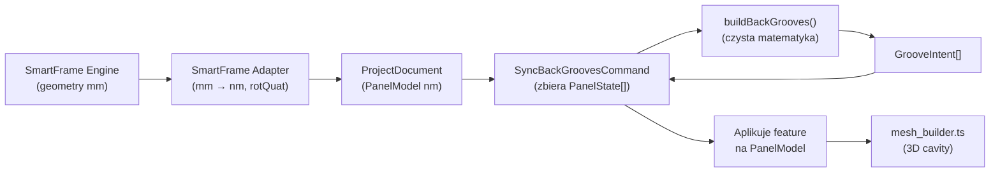

# Algorytm Rowka Pod Plecy — Plan Implementacji (v2)

## 1. Kontekst Architektoniczny

### Przepływ Danych


### Skąd Biorą Się Parametry (Żadnych Stałych!)

| Parametr | Skąd pochodzi | Jak trafia do algorytmu |
|----------|---------------|------------------------|
| **Grubość rowka** (np. 3mm) | `BACK_PANEL.thickness` w silniku → `dim_nm.z` w PanelState | Przecięcie AABB: `iX` lub `iY` w LCS targetu (projekcja grubości pleców) |
| **Głębokość rowka** (np. 11mm) | `back_groove_depth` w JSON (`0.011`m) → silnik pozycjonuje plecy z odpowiednim offsetem | Przecięcie AABB: `iZ` w LCS targetu (głębokość wniknięcia pleców w grubość targetu) |
| **Długość rowka** (np. 2200mm) | Wymiary targetu + wymiary pleców → styk geometryczny | Przecięcie AABB: `iY` w LCS targetu (wysokość styku) |

> [!IMPORTANT]  
> **Zero sztywnych wartości.** Algorytm NIE zawiera żadnych stałych `3`, `11`, `600` itp. Wszystkie wymiary rowka wynikają wprost z przecięcia AABB geometrii pleców z geometrią targetu. Jeśli użytkownik zmieni grubość pleców na 4mm lub `back_groove_depth` na 8mm w konfiguracji, rowek automatycznie dostosuje się bez żadnych zmian w kodzie.

---

## 2. Algorytm (Pseudokod)

```
buildBackGrooves(panels: PanelState[]) → GrooveIntent[]

  backPanels ← panels.filter(role == BACK_PANEL)
  targets    ← panels.filter(role ∈ {SIDE, TOP, BOTTOM, DIVIDER…})

  FOR EACH backPanel IN backPanels:
    backAABB_local ← getLocalAABB(backPanel.dim_nm)    // środek w (0,0,0)
    backCorners_global ← transform(corners(backAABB_local), backPanel.localMatrix)

    FOR EACH target IN targets:
      // Filtr stref: target globalny LUB ta sama strefa co back
      IF target.zone ≠ '' AND target.zone ≠ back.zone: SKIP

      // ── Krok 1: Przecięcie AABB w LCS targetu ──
      targetAABB_local  ← getLocalAABB(target.dim_nm)
      backCorners_inLCS ← transform(backCorners_global, target.localMatrix.invert())
      backAABB_inLCS    ← computeAABB(backCorners_inLCS)
      intersection      ← intersectAABB(targetAABB_local, backAABB_inLCS)

      IF intersection == null: SKIP

      iX ← intersection size along X
      iY ← intersection size along Y
      iZ ← intersection size along Z    // ← głębokość (z offsetu!)

      // ── Krok 2: Klasyfikacja — na wylot czy wpust? ──
      IF iZ ≥ target.dim_nm.z:
        → EMIT dimensionsOverride (skrócenie formatki)
        CONTINUE

      // ── Krok 3: Parametry wpustu — WSZYSTKO z przecięcia ──
      face ← '+Z' jeśli intersection dotyka targetAABB.max.z, inaczej '-Z'
      depth_nm ← iZ                     // ← parametryczna głębokość

      // ── Krok 4: Mapowanie na UV ściany ──
      IF face == '+Z':   // front
        u ← intersection.min.x - targetAABB.min.x
        v ← intersection.min.y - targetAABB.min.y
      ELSE:              // back
        u ← targetAABB.max.x - intersection.max.x
        v ← intersection.min.y - targetAABB.min.y

      width  ← iX                       // ← parametryczna grubość pleców
      length ← iY                       // ← parametryczna długość styku

      → EMIT GrooveIntent { face, u, v, width, length, depth }
```

---

## 3. Weryfikacja Parametryczności na Przykładach

### Przykład A: Plecy 3mm, groove_depth 11mm
- Boczek 600×2200×18 → rowek **3×2200×11** ✓
- Wieniec 964×600×18 → rowek **3×964×11** ✓

### Przykład B: Plecy 4mm, groove_depth 8mm (zmiana konfiguracji)
- Boczek 600×2200×18 → rowek **4×2200×8** ✓
- Wieniec 960×600×18 → rowek **4×960×8** ✓

Żaden hardkod — wszystko wynika z geometrii.

---

## 4. Proponowane Zmiany w Plikach

### [MODIFY] [back-groove-builder.ts](file:///c:/Users/ADM/AppData/Roaming/Blender%20Foundation/Blender/5.0/scripts/addons/CAD/web/A3_smartframe/back-groove-builder.ts)
- Odblokowanie `buildBackGrooves` z algorytmem z sekcji 2.
- Wymiary rowka wprost z przecięcia AABB (`iX`, `iY`, `iZ`).
- Zachowanie logiki "na wylot" (dimensionsOverride).
- **Zero stałych liczbowych** w parametrach rowka.

### [MODIFY] [sync-back-grooves-command.ts](file:///c:/Users/ADM/AppData/Roaming/Blender%20Foundation/Blender/5.0/scripts/addons/CAD/web/A1_core/commands/sync-back-grooves-command.ts)
- Przywrócenie pętli aplikującej intencje (`dimensionsOverride` + `feature`).
- Mapowanie `face: '+Z'→'front', '-Z'→'back'`, konwersja `nm→mm`.

### [MODIFY] [panel-view.ts](file:///c:/Users/ADM/AppData/Roaming/Blender%20Foundation/Blender/5.0/scripts/addons/CAD/web/A4_smartpanel/panel-view.ts)
- Przywrócenie `_renderGroove` z pomarańczową obwódką.

### Pliki BEZ zmian
- `mesh_builder.ts` — poprawnie obsługuje `groove` z `u, v, width, length, depth`.
- `groove-intent.ts` — interfejsy bez zmian.

---

## 5. Verification Plan

### Automated Tests
- `npx vitest run`
- `npm run build`

### Manual Verification
- Podgląd 3D: rowki na boczkach i wieńcach o wymiarach wynikających z konfiguracji (nie hardkodowanych).
